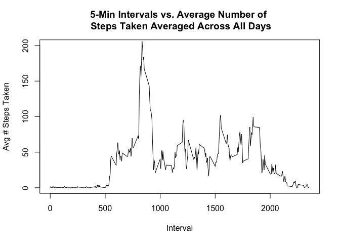
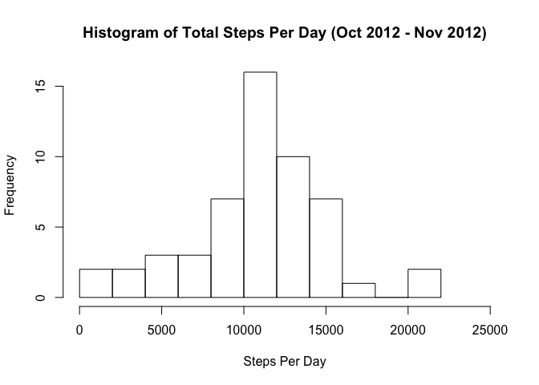

# Reproducible Research: Peer Assessment 1


## Loading and preprocessing the data

### 1. Load in the data


```r
activitydata <- read.csv("activity.csv")
```

### 2. Process/transform the data into a suitable format

```r
head(activitydata)
```

```
##   steps       date interval
## 1    NA 2012-10-01        0
## 2    NA 2012-10-01        5
## 3    NA 2012-10-01       10
## 4    NA 2012-10-01       15
## 5    NA 2012-10-01       20
## 6    NA 2012-10-01       25
```

```r
str(activitydata)
```

```
## 'data.frame':	17568 obs. of  3 variables:
##  $ steps   : int  NA NA NA NA NA NA NA NA NA NA ...
##  $ date    : Factor w/ 61 levels "2012-10-01","2012-10-02",..: 1 1 1 1 1 1 1 1 1 1 ...
##  $ interval: int  0 5 10 15 20 25 30 35 40 45 ...
```

```r
activitydata$date <- as.Date(activitydata$date, format="%Y-%m-%d")
```

## What is mean total number of steps taken per day?

### 1. Calculate the total number of steps taken per day

```r
date.steps <- aggregate(steps ~ date, activitydata, sum)
```

### 2. Make a histogram of the total number of steps taken each day

```r
hist(date.steps$steps, breaks=10, xlab="Steps Per Day",ylab="Frequency", main="Histogram of Total Steps Per Day (Oct 2012 - Nov 2012)", xlim=c(0,25000))
```

 

### 3. Calculate and report the mean and median of the total number of steps taken per day

```r
mean(date.steps$steps)
```

```
## [1] 10766.19
```

```r
median(date.steps$steps)
```

```
## [1] 10765
```
## What is the average daily activity pattern?

### 1. Make a time series plot of the 5-minute interval and the average number of steps taken, averaged across all days 

```r
steps.interval <- aggregate(steps~interval, activitydata, mean)
plot(steps.interval, type="l", main=paste("5-Min Intervals vs. Average Number of", "\n", "Steps Taken Averaged Across All Days"), ylab="Avg # Steps Taken", xlab="Interval", ylim=c(0,200))
```

 

### 2. Which 5-minute interval, on average across all the days in the dataset, contains the maximum number of steps?

```r
steps.interval$interval[which.max(steps.interval$steps)]
```

```
## [1] 835
```

## Imputing missing values

### 1. Calculate and report total number of missing values in dataset

```r
sum(is.na(activitydata$steps))
```

```
## [1] 2304
```

### 2-3. Fill in all missing values in dataset and create new dataset with missing data filled in 

```r
activitydata.clean<-merge(activitydata, date.steps, by="date", suffixes=c("", ".mean"))
nas <- is.na(activitydata.clean$steps)
activitydata.clean$steps[nas]<- activitydata.clean$steps.mean[nas]
activitydata.clean <-activitydata.clean[,c(1:3)]
```

### 4. Make histogram of the total number of steps taken each day and calculate and report the mean and median total number of steps taken per day

```r
date.steps <-aggregate(steps ~date, activitydata.clean, sum)
hist(date.steps$steps, breaks=10, xlab="Steps Per Day",ylab="Frequency", main="Histogram of Total Steps Per Day (Oct 2012 - Nov 2012)", xlim=c(0,25000))
```

 

```r
mean(date.steps$steps)
```

```
## [1] 10766.19
```

```r
median(date.steps$steps)
```

```
## [1] 10765
```
The mean and median total number of steps taken per day do not differ from the estimates from the first part of thee assignment.

## Are there differences in activity patterns between weekdays and weekends?


### 1. Create a new factor variable in the dataset with two levels - "Weekday" and "Weekend"

```r
daytype <- function(dates){
  f <- function(date){
    if (weekdays(date) %in% c("Saturday", "Sunday")){
      "weekend"
    }
    else{
      "weekday"
    }
  }
  sapply(dates, f)
}
activitydata.clean$daytype <- as.factor(daytype(activitydata.clean$date))
str(activitydata.clean)
```

```
## 'data.frame':	15264 obs. of  4 variables:
##  $ date    : Date, format: "2012-10-02" "2012-10-02" ...
##  $ steps   : int  0 0 0 0 0 0 0 0 0 0 ...
##  $ interval: int  1740 1715 1725 1710 1735 1855 1655 1700 1705 2030 ...
##  $ daytype : Factor w/ 2 levels "weekday","weekend": 1 1 1 1 1 1 1 1 1 1 ...
```

### 2. Make a panel plot containing time series plot of the 5-minute interval and avg number of steps taken, averaged across all weekdays or weekend days


```r
library(lattice)
steps.interval <- aggregate(steps ~ interval + daytype, activitydata.clean, mean)
xyplot(steps~interval | daytype, data=steps.interval, layout=c(2,1), type="l")
```

 
