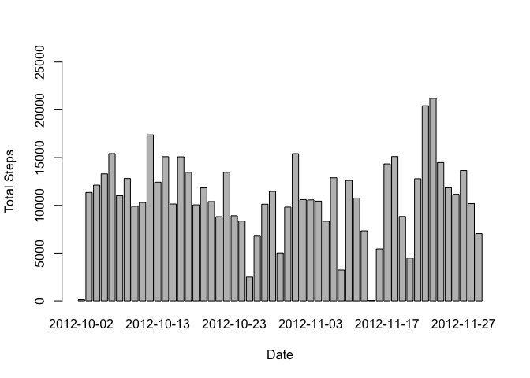
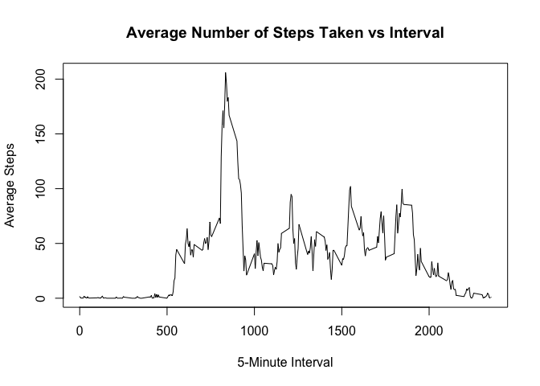

# Reproducible Research: Peer Assessment 1


## Loading and preprocessing the data
1. Load in the data

```r
unzip("activity.zip")
activity <- read.csv("activity.csv",colClass = c('integer', 'Date', 'integer'))
```

## What is mean total number of steps taken per day?


```r
steps.date <- aggregate(steps ~ date, activity, sum)
barplot(steps.date$steps, names.arg=steps.date$date, ylim=c(0,25000), xlab="Date",ylab="Total Steps",)
```

 

```r
mean(steps.date$steps)
```

```
## [1] 10766.19
```

```r
median(steps.date$steps)
```

```
## [1] 10765
```

## What is the average daily activity pattern?


```r
steps.interval <- aggregate(steps~interval, activity, mean)
plot(steps.interval, type="l")
```

 

```r
steps.interval$interval[which.max(steps.interval$steps)]
```

```
## [1] 835
```

## Imputing missing values

```r
sum(is.na(activity$steps))
```

```
## [1] 2304
```

```r
activity.clean<-merge(activity, steps.date, by="date", suffixes=c("", ".mean"))
nas <- is.na(activity.clean$steps)
activity.clean$steps[nas]<- activity.clean$steps.mean[nas]
activity.clean <-activity.clean[,c(1:3)]
head(activity.clean)
```

```
##         date steps interval
## 1 2012-10-02     0     1740
## 2 2012-10-02     0     1715
## 3 2012-10-02     0     1725
## 4 2012-10-02     0     1710
## 5 2012-10-02     0     1735
## 6 2012-10-02     0     1855
```

```r
steps.date <-aggregate(steps ~date, activity.clean, sum)
barplot(steps.date$steps, names.arg=steps.date$date, ylim=c(0,25000), xlab="Date",ylab="Total Steps",)
```

 

```r
mean(steps.date$steps)
```

```
## [1] 10766.19
```

```r
median(steps.date$steps)
```

```
## [1] 10765
```


## Are there differences in activity patterns between weekdays and weekends?

```r
daytype <- function(dates){
  f <- function(date){
    if (weekdays(date) %in% c("Saturday", "Sunday")){
      "weekend"
    }
    else{
      "weekday"
    }
  }
  sapply(dates, f)
}
activity$daytype <- as.factor(daytype(activity$date))
str(activity)
```

```
## 'data.frame':	17568 obs. of  4 variables:
##  $ steps   : int  NA NA NA NA NA NA NA NA NA NA ...
##  $ date    : Date, format: "2012-10-01" "2012-10-01" ...
##  $ interval: int  0 5 10 15 20 25 30 35 40 45 ...
##  $ daytype : Factor w/ 2 levels "weekday","weekend": 1 1 1 1 1 1 1 1 1 1 ...
```

```r
library(lattice)
steps.interval <- aggregate(steps ~ interval + daytype, activity, mean)
xyplot(steps~interval | daytype, data=steps.interval, layout=c(2,1), type="l")
```

 
