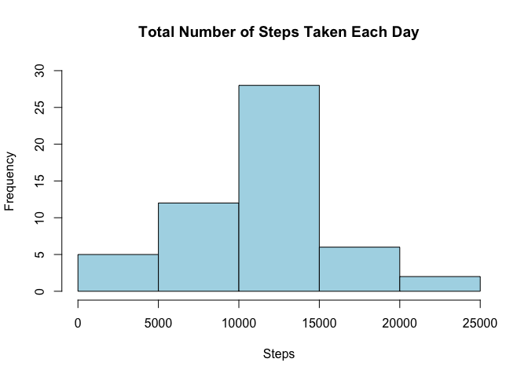
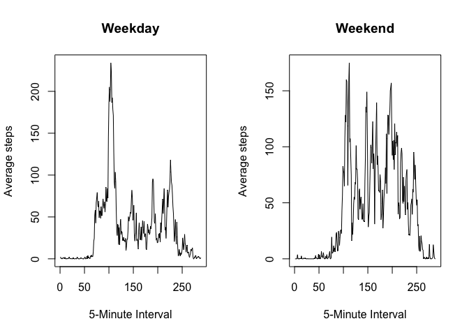

# PA1_template
Katherine Healy  
March 29, 2016  


***
### 1. Load and preprocess dataset


```r
data_full <- read.csv("activity.csv", na.strings="NA")
data_full$date <- as.Date(data_full$date, format="%Y-%m-%d")
```

### 2. What is the mean total number of steps taken per day?


```r
steps_per_day <- aggregate(steps ~ date, data_full, sum)
hist(steps_per_day$steps, xlab="Steps", ylab="Frequency", main="Total Number of Steps Taken Each Day", ylim=c(0,30), col="lightblue")
```

 

```r
mean(steps_per_day$steps)
```

```
## [1] 10766.19
```

```r
median(steps_per_day$steps)
```

```
## [1] 10765
```

### 3. What is the average daily activity pattern?


```r
steps_per_interval <- aggregate(steps ~ interval, data_full, mean)
plot(steps_per_interval, type="l", xlab="5-Minute Interval", ylab= "Average Steps", main="Average Number of Steps Taken vs Interval")
```

 

```r
steps_per_interval[which.max(steps_per_interval$steps),]
```

```
##     interval    steps
## 104      835 206.1698
```

### 4. Imputting Missing Values


```r
sum(is.na(data_full$steps))
```

```
## [1] 2304
```

Fill in missing values using the mean of the day.


```r
data_clean <- merge(data_full, steps_per_day, by="date", suffixes=c("", ".mean"))
na <- is.na(data_clean$steps)
data_clean$steps[na] <- data_clean$steps.mean[na]
data_clean <- data_clean[,c(1:3)]
steps_per_day_clean <- aggregate(steps ~ date, data_clean, sum)
hist(steps_per_day_clean$steps, xlab="Steps", ylab="Frequency", main="Total Number of Steps Taken Each Day", ylim=c(0,30), col="lightblue")
```

 

```r
mean(steps_per_day_clean$steps)
```

```
## [1] 10766.19
```

```r
median(steps_per_day_clean$steps)
```

```
## [1] 10765
```

Mean and median values do not differ from the estimates from the first part of the assignment because we used th mean of the day to fill in missing values.

### 5. Differences in activity patterns between weekdays and weekends


```r
daytype <- function(dates){
  f <- function(date){
    if (weekdays(date) %in% c("Saturday", "Sunday")) {
      "weekend"
    }
    else {
      "weekday"
    }
  }
  sapply(dates,f)
}
data_clean$daytype <- as.factor(daytype(data_clean$date))
steps_per_interval_clean <- aggregate(steps ~ interval + daytype, data_clean, mean)
par(mfrow=c(1,2))
plot(subset(steps_per_interval_clean, daytype=="weekday")$steps, type="l", xlab="5-Minute Interval", ylab="Average steps", main="Weekday")
plot(subset(steps_per_interval_clean, daytype=="weekend")$steps, type="l", xlab="5-Minute Interval", ylab="Average steps", main="Weekend")
```

 
